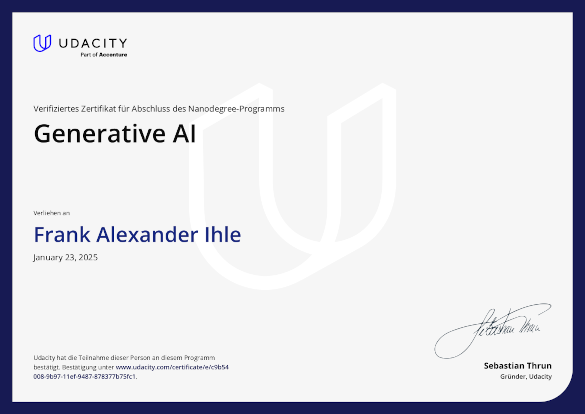

# GenAI
This repo covers basic experiments around generative artifical intelligence in order to get a better feeling of its capabilities and limitations

In the subfolders different aspects are being evaluated and briefly introduced below

| Experiment   |     Description      |
|--------------|:--------------------:|
| large model fine tuning |  Take a publicly available foundation model and retrain on sentiment classification. Use different strategies and compare the individual results |
| chat bot | Use a LLM to evaluate a given topic and compare vanilla performance with a model, where more topic-specific context has been provided. (RAG)   |
| image manipulation | take a casual picture and manipulate an image-selection  only by text prompts |
| holisitic GenAI product | Compose a holisitic GenAI product by the techniques by the experiments above. For a real estate agent, virtual offers are artificially created, handled in a vector database and with the help of an LLM eventually some highly customer-specific advertisments are generated.

Each individual sub program is setup as jupyter notebook and can be executed individually. 

## Side notes

For the sake of readbility and traceability the amount of code quality measures intentionally have been kept low

All content has been worked out during a Udacity Nano Degree training

